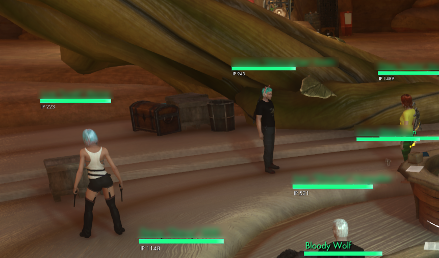

# IP Man  
Displays players IP under their nametag, max IP is shown inside a parenthesis  
Also adds max IP to character sheet  
You can use `/option IP_OnlyTargeted true` chat command to only show players IP when you target them.  
  
Install: unzip to `SWL\Data\Gui\Custom\Flash`  
